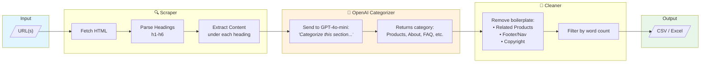
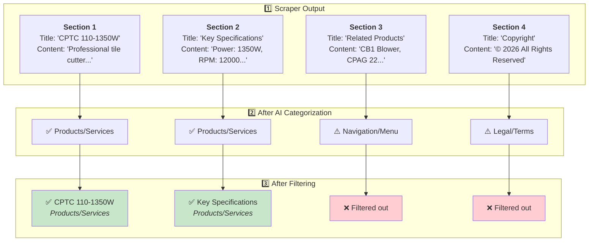

# Neptune 🌊

A web-based tool to extract section titles and content from websites, with AI-powered categorization and smart filtering.

## Architecture



### Data Flow Example



## Features

- **Web Interface** - Easy-to-use Streamlit UI for scraping websites
- **Section Extraction** - Extract all headings (h1-h6) and their content from webpages
- **AI Categorization** - Automatically categorize sections using OpenAI (Products, About, Contact, etc.)
- **Smart Filtering** - Remove boilerplate content like "Related Products", footers, navigation
- **Customizable Filters** - Edit YAML config to add/remove filter rules
- **Multiple Export Formats** - Download results as CSV or formatted Excel
- **Grid Layout Support** - Handles modern websites with content in separate columns

## Quick Start

### Option 1: Deploy to Railway (Recommended)

1. Fork this repo
2. Go to [railway.app](https://railway.app) → New Project → Deploy from GitHub
3. Select the `deploy/railway` branch
4. Add environment variable: `OPENAI_API_KEY`
5. Generate a domain and you're live!

### Option 2: Run Locally

```bash
# Clone and setup
git clone https://github.com/balakumar66/neptune.git
cd neptune
python -m venv venv
source venv/bin/activate  # Windows: venv\Scripts\activate

# Install dependencies
pip install -r requirements.txt

# Set up environment
cp .env.example .env
# Edit .env and add your OPENAI_API_KEY

# Run the app
streamlit run src/app.py
```

## Usage

### Web Interface

1. Open the app in your browser (default: http://localhost:8501)
2. Enter URLs (one per line)
3. Click "Start Extraction"
4. Download results as CSV or Excel

### Command Line (Advanced)

```bash
python src/main.py --input data/urls.csv --output data/output.csv --categorize
```

## Configuration

### Filter Customization

Edit `config/filters.yaml` to customize what content gets filtered:

```yaml
# Minimum words required for a section
min_word_count: 5

# Section titles to exclude (case-insensitive)
excluded_section_titles:
  - "related products"
  - "you may also like"
  - "footer"
  # Add your own...

# Keywords that indicate boilerplate
boilerplate_keywords:
  - "copyright"
  - "privacy policy"
  # Add your own...
```

### Environment Variables

| Variable | Required | Description |
|----------|----------|-------------|
| `OPENAI_API_KEY` | Yes | OpenAI API key for AI categorization |

## Output Format

The exported CSV/Excel contains:

| Column | Description |
|--------|-------------|
| `row_no` | Row number for reference |
| `url` | Source URL |
| `page_title` | Page title from `<title>` tag |
| `description` | Page meta description |
| `section_title` | Heading text |
| `section_level` | Heading level (h1-h6) |
| `content` | Text content under that section |
| `ai_category` | AI-assigned category |

## Project Structure

```
neptune/
├── config/
│   └── filters.yaml      # Customizable filter rules
├── src/
│   ├── app.py            # Streamlit web interface
│   ├── scraper.py        # Web scraping logic
│   ├── categorizer.py    # AI categorization
│   ├── cleaner.py        # Data filtering
│   └── main.py           # CLI interface
├── Procfile              # Railway deployment
├── railway.json          # Railway config
└── requirements.txt
```

## Deployment

### Railway

The `deploy/railway` branch is configured for Railway deployment:

- Auto-deploys on push
- Uses Nixpacks builder
- Health checks enabled

### Streamlit Community Cloud

Also compatible with Streamlit Cloud - just point to `src/app.py`.

## License

MIT
